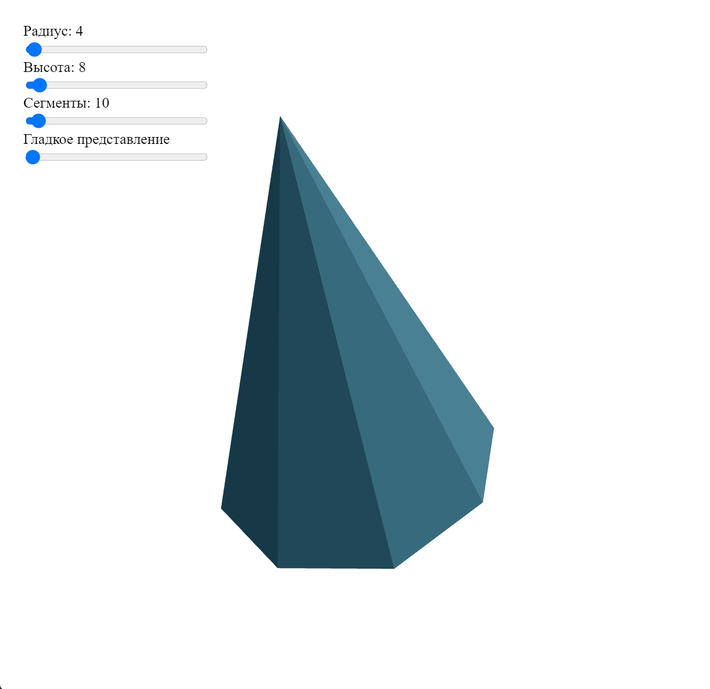

# microerp Next Generation (meng)
(перевыпуск репозитория)

Это дальнейшее развитие сервиса http://microerp.promdev.ru, предназначенного для совместной работы с 
инженерными данными различных категорий работников промышленных предприятий. 

### Приветственная страница

Это fullstack проект, разработка которого продолжается в настоящее время.

На текущий момент в нем используются технологии, библиотеки, а так же реализованы подходы:

**backend**
- Python 
- Flask (микрофреймворк)
- SQLAlchemy (ORM для баз данных)
- marshmallow (сериализации/десериализации объектов)
- jwt extended (токены доступа)
- реализовано определение местоположения методом обратного геокодирования через API DaData

**frontend**
- React
- React Router
- React REDUX/REDUX TOOLKIT
- React Hook Form
- AXIOS
- material-ui
- module scss
- адаптивность

**DevOps**
- Linux Ubuntu LTS
- MySQL
- Gunicorn (сервер приложений)
- NGINX

В сервисе реализованы дополнительные модули:
- редактор баз данных,
- визуализатор загрузки оборудования.

### Редактор баз данных

Предназначен для подготовки данных для инженерных модулей сервиса microerp.promdev.ru. 
Подготовка реализуется за счет создания, редактирования и удаления списков различных ресурсов 
предприятия - оборудования, режущего инструмента, технологического оснащения, средств контроля 
и пр. Каждый элемент списка может содержать вложенные элементы и тогда он становится 
группирующим элементом, при этом уровень вложенности не ограничен. Это дает  возможность 
пользователю настроить разделение типов ресурсов с любой степенью детализации одновременно с 
формированием интуитивного древовидного представления.
Модуль поддерживает многопользовательской режим работы и  синхронизацию изменений данных 
между всеми одновременно работающими пользователями в реальном времени. Этим обеспечивается 
не только параллельная работа, но и защита от использования устаревших данных.

Дополнительные технологии и подходы:
WebSocket (socket-io), SVG, рекурсии

### Визуализатор загрузки оборудования

Предназначен для представления загрузки оборудования в виде гистограммы и «светофорной» 
индикации перегруза. Имеется возможность пересчета загрузки на месяц, квартал, полугодие, год на 
клиенте.
Источником данных является файл exel, заполняемый инженерными работниками отдельно от 
сервиса. Он проходит парсинг, очитку и другую подготовку данных на сервере с применением 
профессиональной библиотеки pandas, широко используемой в data science.

Дополнительные технологии:
Pandas

Замечания:
- Клиентская часть приложения не имеет макетов данных, заменяющих API и часть функций, завязанных на API будут недоступны.

